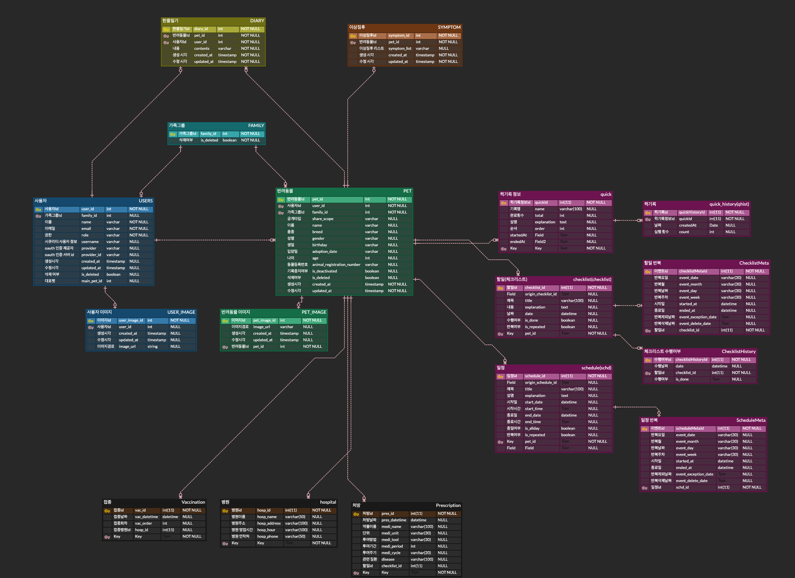

# 펫하루

## 소개
반려동물 라이프로깅 서비스
- 문제 의식: 반려동물 케어가 잘 이루어지고 있는지 체크하기 어려움
- 해결: 놀이, 훈련, 이상징후 등 케어 사항을 기록하고, 필요 시 그룹 펫 등록을 통해 케어 사항 공유

## 기능

### 회원
* OAuth 2.0 회원가입 및 로그인
  * 카카오톡
  * 구글
* 회원 프로필 수정
* 회원 탈퇴
### 가족 그룹
* 가족 그룹 등록
* 가족 그룹 구성원 생성
* 가족 그룹 구성원 내보내기
* 가족 그룹 탈퇴
* 가족 그룹장 권한 위임
### 펫
* 펫 등록(멀티 펫 등록 지원)
* 대표 펫 설정
* 펫 프로필 수정
* 펫 공유
* 펫 기록 비활성화
* 펫 삭제
### 펫 케어
* 체크리스트
* 반복 일정
* 퀵 기록
* 한줄일기
* 이상징후
* ~~놀이~~
* ~~훈련~~
* ~~접종~~
* ~~병원~~
* ~~처방~~
### 서비스 설정
* 공지사항
* 피드백